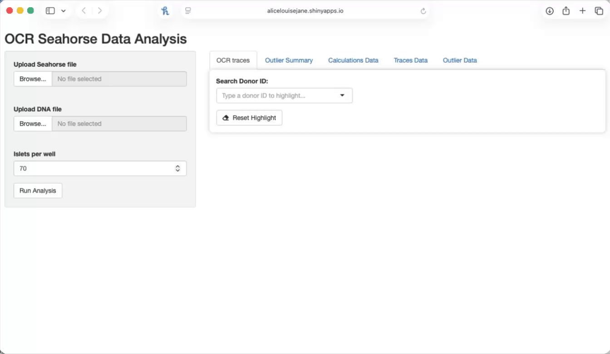

```{r setup, include=FALSE}
knitr::opts_chunk$set(
  echo = FALSE,
  message = FALSE,
  warning = FALSE
)
library(readxl)
library(knitr)
```

-   [How to run the app](#how-to-run-the-app)
-   [Data Input](#data-input)
-   [Data Processing and Outlier
    Identification](#data-processing-and-outlier-identification)
-   [Outlier Visualisation](#outlier-visualisation)
-   [Trace Visualisation](#trace-visualisation)
-   [Bioenergetic Parameters](#bioenergetic-parameters)

> **This analysis pipeline is designed specifically for the Seahorse OCR
> injection-phase protocol used for donor islet studies at the Alberta
> Diabetes Institute.**

This repository contains the code for an interactive Shiny app for
processing and visualising Seahorse OCR data, including:

-   Trace visualisation across normalisation methods (Raw, DNA, DNA +
    Baseline)
-   Computation of bioenergetic parameters, including Bioenergetic
    Health Index (BHI) and glucose-stimulated metrics
-   Computation of phase-specific AUC across the assay phases:
    -   2.8 mM glucose
    -   16.7 mM glucose
    -   Oligomycin
    -   FCCP
    -   Rotenone/Antimycin
-   Outlier detection:
    -   Tukey-based outliers for calculated parameters and phase AUC
    -   First-value outliers (\<50 or \>450 pmol/min)
-   Interactive exploration and download of results tables


------------------------------------------------------------------------

## How to run the app {#how-to-run-the-app}

The app is available via Shiny:

<https://alicelouisejane.shinyapps.io/OCR_Analysis_App/>

No installation is required—simply upload your OCR and DNA files and run
the analysis directly in the browser.

If you prefer to run the app locally in R:

#### 1) Clone or download the repository

```         
git clone https://github.com/<your-username>/ocr-analysis-app.git
```

#### 2) Install required R packages

``` r
install.packages(c(
  "shiny", "plotly", "DT",
  "rio", "dplyr", "tidyr", "stringr",
  "ggplot2", "pracma"
))
```

#### 3) Run the app

``` r
shiny::runApp("app.R")
```


------------------------------------------------------------------------

## Data Input {#data-input}

The app requires **two input files**:

### 1. Seahorse OCR data file

-   Wide format (as exported / structured for RedCap upload)
-   The first column contains OCR time values (`value_1.38`,
    `value_26.89`, etc.)
-   Each **column** represents a **donor_replicate**
-   **The first row is left blank**

**Example format for the Seahorse OCR input file**
```{r}
ocr_example1 <- read_excel(
  "docs/OCR_dataformat_and_definitions.xlsx",
  sheet = "ocr_file",
  col_names = FALSE
)

kable(ocr_example1)
```

------------------------------------------------------------------------

### 2. DNA content file

-   Wide format
-   Each column = donor_replicate
-   First row blank
-   First row must include variable name: **meta_dna_cont**
-   DNA in \mu g

If missing, an approximation is used: 1 IEQ ≈ 9000 pg DNA with
approximately 70 IEQs per well ≈ 0.63 \mu g DNA . Number of IEQs per
well can be changed.

> **Development:** currently DNA-only normalisation not protien

**Example format for the DNA input file**

```{r}
ocr_example2 <- read_excel(
  "docs/OCR_dataformat_and_definitions.xlsx",
  sheet = "dna_file",
  col_names = FALSE
)

kable(ocr_example2)
```

1.  **Replicate-level quality control** A Tukey-based outlier check is
    applied within each donor and timepoint (on raw OCR values).
    Replicates flagged as potential outliers are **retained** and not
    removed.

2.  **Averaging across replicates** OCR values are averaged across
    replicates for each donor and timepoint. These averaged values are
    used for all downstream analyses and visualisation (including trace
    plots).

3.  **Derivation of summary metrics** From the averaged data: -
    bioenergetic parameters are calculated - phase-specific AUC values
    are computed

4.  **Outlier identification on derived metrics** A second Tukey-based
    outlier check is applied to: - bioenergetic parameters -
    phase-specific AUC values - Raw OCR values are additionally flagged
    if: \<50 pmol/min or \>450 pmol/min

> **Note on interpretation of outliers** Outliers identified are **not
> removed** from the dataset and should not be interpreted as errors or
> exclusions. These flags highlight values that are unusual relative to
> the observed distribution and may warrant further investigation in the
> context of experimental conditions, assay performance, or biological
> variability.
>
> As such, flagged outliers represent **distribution-based deviations**,
> not automatic indicators of poor-quality measurements.

## Outlier Visualisation {#outlier-visualisation}

The **Outlier Data tab** contains all identified outliers across
categories:

-   **Calculation and Phase AUC outliers**\
    Identified using the Tukey method:\
    values \< Q1 − 1.5×IQR or \> Q3 + 1.5×IQR

-   **First-value outliers**\
    Defined on raw OCR measurements as values \<50 or \>450 pmol/min

The displayed table represents the **combined output** of all outlier
types.

Separate tables for each outlier category (Calculation, Phase AUC, and
First-value outliers) can be downloaded individually.

------------------------------------------------------------------------

The **Outlier Summary tab** provides a visual overview of these
outliers:

-   Each point represents an individual **donor replicate**
-   Panels are shown per **bioenergetic parameter** or **phase-specific
    AUC**
-   Points are colour-coded:
    -   **Green** - within expected range
    -   **Red** flagged as a Tukey outlier

Interactive hover enables exploration of donor ID, parameter or phase
and corresponding value

## Trace Visualisation {#trace-visualisation}

The **OCR traces tab** displays donor-level trajectories across time
over three panels for Raw OCR, DNA-normalised OCR and DNA + baseline
normalised OCR (fold change). Background coloured bands indicate
injection phases. Shape of curves reflects mitochondrial function.
Differences between normalisation methods highlight cell number
variation (DNA) and relative functional response (baseline).

Interactive highlighting allows you to click a donor to highlight. Use
the search bar to locate specific donor IDs which will highlight across
all three panels.

The **Traces Data tab** provides the underlying data used for
visualisation in a downloadable format. This includes time-resolved OCR
values across all normalisation types and associated metadata (e.g.,
phase assignment and quality flags).

## Bioenergetic Parameters {#bioenergetic-parameters}

Bioenergetic parameters are available in the **Calculations Data tab**,
presented in long format with one row per parameter per normalisation
type.

These parameters are calculated using established Seahorse XF analysis
definitions. The **Bioenergetic Health Index (BHI)** is derived as
described in the [Agilent BHI Report Generator User
Guide](https://www.agilent.com/Library/usermanuals/Public/BHI_Report_Generator_User_Guide_RevA.pdf).

Parameters are calculated on Raw OCR data and DNA-normalised OCR data,
with the latter the preferential for use.

Parameters are **not calculated** on data normalised to baseline, as
baseline normalisation represents fold change and is not appropriate for
absolute bioenergetic metrics.

**Definitions of the bioenergetic parameters are listed below:**

```{r, echo=F}
library(readxl)
library(knitr)

ocr_definitions <-
  read_excel("docs/OCR_dataformat_and_definitions.xlsx", 
             sheet =
"bioenergetics", col_names = TRUE )

kable(ocr_definitions)
```
